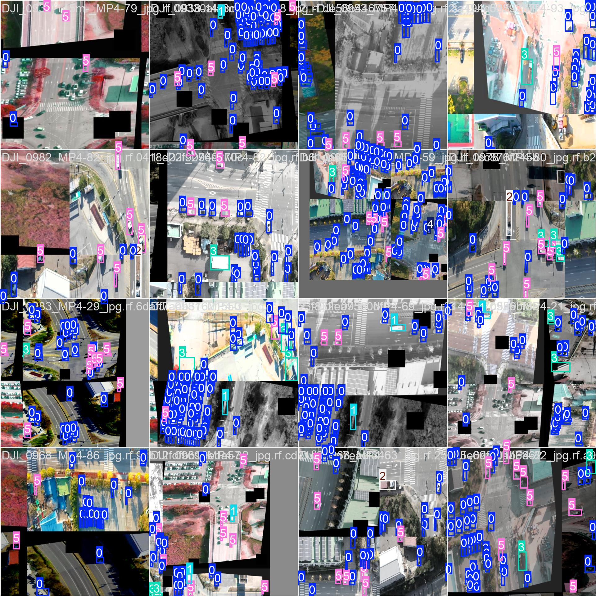
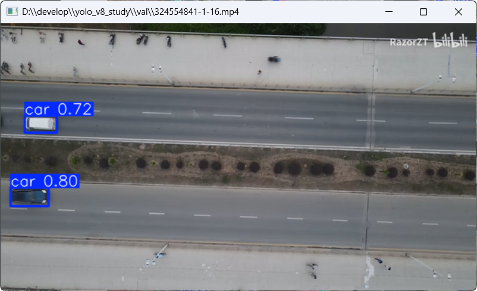

# yolo_v8_study

自用仓库，仅用于学习YoloV8

注：Github markdown屏蔽部分html，验证视频见`doc/readme`目录

| 数据集名称 | 类型         | 分类标记 | 数据集路径 | 基础模型  | 训练轮数 | 产物路径              | 时间       |
| ---------- | ------------ | -------- | ---------- | --------- | -------- | --------------------- | ---------- |
| car        | 高空航拍道路 | 车辆     | `db/car`   | `yolov8n` | 6        | `runs/detect/train13` | 1727095642 |
| more       |              |          |            |           |          |                       |            |

## Car

1. 原始数据：
   

2. 不同数据验证：

   

   <video id="video" controls="" preload="none" poster="封面">
      <source id="mp4" src="doc/README/QQ2024923-21458.mp4" type="video/mp4">
   </videos>
